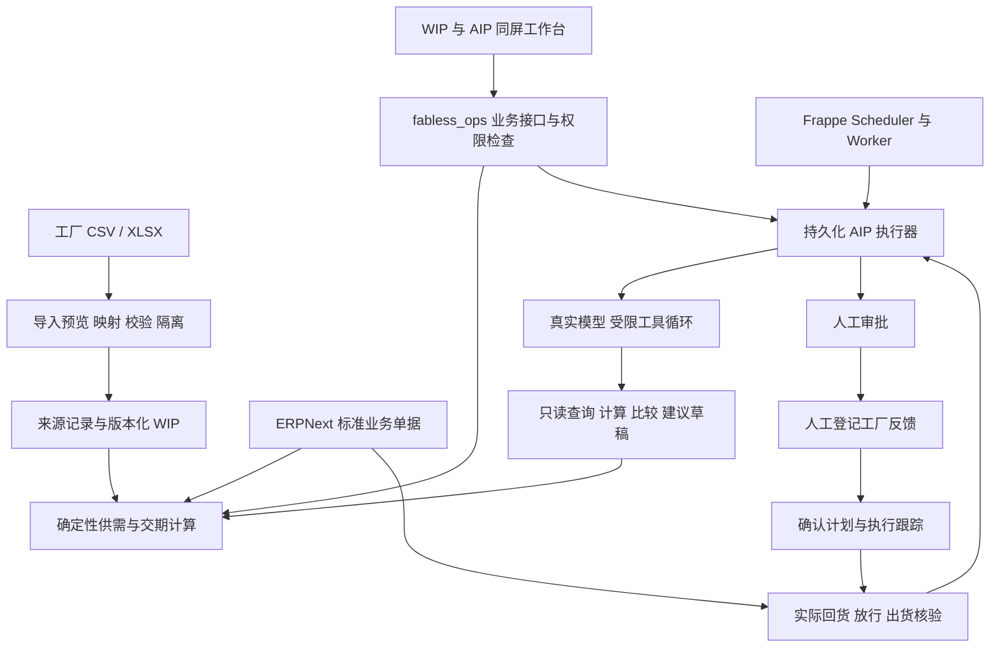

# Fabless WIP 与 AIP 基于 ERPNext 的完整验证版实施方案

状态：已确认的目标方案，待实现。本文描述独立 ERPNext 验证版，不代表仓库当前代码已经具备这些能力。

当前仓库提供 mock 数据驱动的 WIP/AIP 工作台、确定性计算、SQLite/D1 持久化及模拟协调流程。ERPNext 扩展应用、真实模型工具循环和下述集成验收尚未完成。现有线上演示保持独立，不覆盖、不迁移其数据。

## 1 目标与业务范围

让采购运营人员完成完整闭环：

**看清生产状态 → 发现交付风险 → Agent 分析并提出建议 → 人工审核 → 跟进工厂回复 → 核验实际交付。**

采购团队在本场景承担计划与生产协调职责：决定投料时间、型号优先级、回货安排和交期回复。产品围绕三条工作流建设：

| 工作流 | 触发 | 处理 | 结果 |
| --- | --- | --- | --- |
| 晨间 WIP 核对 | 定时或人工导入工厂文件 | 映射、去重、质量与时效检查、对比前次状态、计算交付影响 | 异常事项、负责人、下次复核时间 |
| 销售交期查询 | 销售选择客户、项目、完整 PN 或订单行 | 检查未交余额、现货、在制、分配及路线 | 数量分段、交期区间、来源和待确认条件 |
| 延期与急单协同 | 批次延期、订单提前或人工发起 | 计算影响、比较方案、审批、登记工厂回复、跟踪实际 | 经核验的交付结果和剩余缺口承接事项 |

WIP（Work in Process）管理物料和批次；AIP（Agent in Process）管理业务处理事项。两者通过订单、批次和证据关联，分别维护状态。

首版不含客户销量预测模型、代理商备货意愿模型、全局有限产能最优排程、自动工厂下单、真实消息发送及客户生产系统写回。保留预测版本与渠道授权数据结构，为后续扩展留接口。

## 2 实现路线与系统职责

采用 **ERPNext + 独立 Frappe 应用 fabless_ops + 现有 WIP/AIP 前端 + 真实模型接口**。不修改 ERPNext 核心代码。

| 层 | 职责 | 不承担的职责 |
| --- | --- | --- |
| ERPNext | 客户、供应商、物料、项目、订单、外协、库存及收发货台账 | 不由 WIP 导入代替库存过账 |
| fabless_ops | Fabless 业务关系、来源事实、供需分配、事项状态、权限与审计 | 不复制一套独立库存账 |
| 确定性工具 | 净需求、良品换算、分配、交期、方案影响 | 不让模型自由生成数量与日期 |
| 模型 | 理解问题、选择允许的工具、解释结果、起草建议 | 不直接审批、过账、确认工厂承诺 |
| 前端 | 展示事实、估计、方案、审批和核验入口 | 不成为业务状态权威来源 |

验证版中 ERPNext 是交易台账权威来源；工厂文件提供生产进度事实。接入客户系统时按对象重新确定权威来源，不默认替换原 ERP/OA/CRM。

## 3 Ontology 与数据模型

首版通过关系表、关联字段和业务方法实现 Ontology，不引入图数据库。

核心链路：客户 → 项目 → 完整 PN → 销售订单行 → 供需分配 → 生产批次 → 来源证据；批次通过 Die、生产路线、合格供应商连接供给约束，AIP 事项关联受影响对象。

### 3.1 复用标准对象

客户、供应商、物料、项目、销售订单、采购订单、外协订单、库存、收货及出货单据采用 ERPNext 标准对象与流程。客户/代理商 PO 是销售需求来源，原厂采购 PO 是供给侧采购指令，分别存储和展示。出货数量与财务收入不混用。

外协发料与回货依照 [ERPNext 官方外协流程](https://docs.frappe.io/erpnext/subcontracting) 实施，并以目标版本实际接口进行集成验证。

### 3.2 扩展对象

以下是逻辑模型，实施时映射为独立或子表 DocType；业务主键、关联和审计信息必须保留。

| 对象 | 核心字段与关系 |
| --- | --- |
| 客户项目与 PN 关系 | 客户、项目、完整 PN、项目阶段、需求期间、客户侧料号、代理商及授权有效期 |
| Die 与产品路线 | Die 类型、兼容 PN、封装、工序顺序、合格供应商、测试路线、单位换算依据及版本 |
| 生产批次 | 内部/供应商批次号、Die、已确定 PN、供应商、工序、原始数量及单位、质量、冻结/返工、父子批次、路线、工厂实报与承诺 |
| WIP 来源记录 | 来源系统/文件、来源行标识、业务时间、接收时间、原始内容、映射结果、可信状态、内容摘要、数据版本 |
| 供需分配 | 销售订单行、供给批次、分配数量及单位、预计日期、分配条件、计划版本 |
| 需求预测版本 | 客户、项目、完整 PN、期间、预测数量、版本、有效状态、订单冲减、剩余预测 |
| AIP 事项 | 异常去重键、触发原因、关联对象、负责人、状态、阻塞原因、下一步、复核时间、后续事项 |
| 分析运行 | 模型名称、输入快照、业务版本、检查点、工具调用及结果、证据、耗时、错误 |
| 候选方案 | 变更清单、前后指标、受影响订单、前置条件、可执行性、依据版本、历史版本 |
| 审批记录 | 审批人、时间、方案版本、理由、决定、审批时业务版本 |
| 协调请求与反馈 | 请求标识、内部批准、反馈文本/附件、接受/拒绝/部分接受、数量、日期、登记人、承诺及实际核验 |

每项事实或建议保留证据类型：**工厂实报、工厂承诺、系统估计、Agent 推断**。同时记录业务时间和系统接收时间，避免把较晚收到的旧报表当作最新状态。

### 3.3 不可破坏的业务规则

1. 完整 PN 独立识别，包括封装和尾缀；共享 Die 只有明确投料分配后才能成为指定 PN 供给，不能重复覆盖多个 PN。
2. wafer、die、pcs 分别保存。换算需明确每片有效 Die 数、适用良率及版本；无依据时显示未知并转核对。
3. 冻结和返工作为批次状态，保留实际工序；质量未满足要求的供给不能视作可发库存。
4. 库存交易仅由 ERPNext 业务单据产生；WIP 导入、方案比较、内部审批和工厂承诺均不增加库存或记录出货。
5. 分配不得超过可用供给，同一批次拆分给不同订单时累计占用必须守恒；拆合批保留血缘和数量依据。
6. 预测冲减限定相同客户、项目、PN、期间；出货减少订单未交余额，不再次冲减预测。
7. 代理商库存按客户授权使用，不默认跨客户调拨。无法关联的记录进入待核对队列，不强行归因。
8. 原始记录不可被后续导入静默覆盖；错误行隔离，最后可信事实仍可查询。

### 3.4 数量口径

在相同业务维度和期间内，先计算有效订单（扣除取消量）和已履约数量：

- 未交订单 = 有效订单数量 − 已有效出货数量。
- 剩余预测 = max(有效预测 − 已匹配有效订单数量, 0)。
- 未来待覆盖 = 未交订单 + 剩余预测。
- 到期缺口 = max(订单未交 − 到期前已分配的可用供给, 0)。

mock 示例：预测 100 万、有效订单 60 万、已发 20 万，则未交 40 万、剩余预测 40 万、未来待覆盖 80 万。订单与预测之间必须保留匹配证据，不能跨期间简单汇总相减。

预计良品根据原始单位、不可用数量、换算依据和剩余路线良率计算；实际回货以业务单据为准。交期按工序排队、加工、放行和运输时间及工作日历计算区间，不把“完成 80%”简单等比例换算成剩余天数。

## 4 WIP 与 AIP 产品行为

### 4.1 同屏工作台

沿用深色界面：青色选中、紫色 Agent 活动、橙色待确认、红色风险、绿色已验证；所有颜色同时配文字状态。

- 顶部：客户、项目、完整 PN、供应商筛选；数据时间、同步状态、演示场景入口。
- 指标：交付风险订单、待人工决策、待工厂确认、今日预计回货。
- 左侧 WIP：批次看板、台账、按日工厂/工序时间轴。
- 右侧 AIP：业务目标、读取依据与工具、方案比较、审批与工厂反馈、执行与结果核验。
- 底部：客户 → 项目 → 完整 PN → 订单未交 → 覆盖 → 缺口。

工序：晶圆制造 → CP → Die 库存 → 封装 → 测试 → 放行 → 成品/在途。批次卡片展示工厂、数量及单位、预计良品、已分配量、剩余路线、承诺、质量、异常及来源时间。

订单详情分别展示订单量、已发、未交、现货覆盖、预计在制覆盖和到期缺口。点击异常展开 AIP；点击方案高亮受影响批次与订单。

时间轴分开显示当前计划、建议计划、工厂已确认计划。缺档期依据时显示待确认，不能把其他工厂标为已可用。窄屏以 WIP/AIP 标签切换，保留选中事项；另提供 AIP 全屏流程视图。

### 4.2 AIP 状态机

**待分析 → 分析中 → 待人工决策 → 待工厂确认 → 执行跟踪 → 待结果核验 → 已关闭。**

| 环节 | 必要行为与状态条件 |
| --- | --- |
| 发现变化 | 同一异常创建或更新同一事项，保存来源记录 |
| 核对事实 | 读取订单未交、库存、批次、路线、质量、授权及时间；缺资料转人工并显示原因 |
| 计算影响 | 使用确定性工具输出受影响订单、客户项目和到期缺口 |
| 比较方案 | 维持计划、现货分批发、调整测试优先级；其他工厂为待核实选项 |
| 人工决策 | 展示改善量、剩余缺口、其他订单损失和条件；记录选择与理由，检查依据版本 |
| 工厂确认 | 人工登记回复文本与附件；批准方案不等于工厂接受 |
| 执行跟踪 | 工厂接受后更新确认计划；实际回货/出货使用业务单据 |
| 结果核验 | 核对新 WIP、回货、质量放行与出货；仅承诺不能结案，剩余缺口有后续事项 |

拒绝后回到人工决策；部分接受必须指定数量与日期，重算影响并再次审核；回复超时生成复核待办。模型失败、资料缺失和冲突进入待人工决策，保留已完成步骤。

## 5 Agent 与确定性工具

通过服务端配置兼容 API 的 base_url、model 和密钥；密钥不得进入前端、源码或日志。真实模型负责理解、工具选择、解释和协调建议草稿。

首批允许工具：

1. 查询订单、批次和来源证据。
2. 检查数据新鲜度、字段完整性和业务关联。
3. 计算净需求、供给覆盖和交期区间。
4. 比较维持计划、分批交付和测试优先级调整。
5. 创建建议草稿和下一次复核任务。

库存过账、审批、工厂承诺确认不暴露为模型直接执行工具。禁止任意 SQL、任意单据写入和未授权数据访问。

工具循环最多 8 轮，单次运行总超时 120 秒；轮数及总时限由执行器强制控制。每次工具执行持久化输入、输出、成功/失败、证据时间和检查点。界面动画只展示已经完成的步骤。

数量与日期采用结构化计算结果呈现；模型引用不存在的对象或证据时拒绝结果并转人工。需要验证模型叙述与工具结果的一致性，不能仅验证 JSON 格式。

TypeSafe/Jev 保留独立适配入口，用于有边界的结构化判断；不作为首版必需服务，也不代替库存、数量和交期计算。

## 6 持久化 权限与接口

### 6.1 持久化与恢复

MariaDB 保存业务及 AIP 状态，Redis 与 Frappe Worker 处理后台任务。业务状态不依赖浏览器或模型对话历史。

- 每条变更命令使用幂等键；同键同载荷返回既有结果，同键不同载荷拒绝。
- 分析运行保存输入快照和检查点；重启后由恢复机制重试未完成工作，已提交动作不重复执行。
- 同一异常按业务关联与异常类型去重，更新现有未结事项。
- 审批前复核关联订单、批次、路线和约束版本。变化则旧方案失效，保留历史并重新分析。
- 事项状态、审批、计划更新和审计在事务边界内保持一致；并发审批和重复点击必须测试。
- 数据导入、模型运行、审批和实际业务结果分别留痕。

### 6.2 角色

| 角色 | 权限 |
| --- | --- |
| 销售只读 | 查询授权范围内订单、覆盖和交期；不得修改供给或审批 |
| 采购处理 | 导入、核对、发起分析、提交方案、登记工厂反馈及复核 |
| 采购负责人审批 | 审核方案，查看影响及审计依据 |
| 管理员配置 | 系统配置、角色及连接配置；密钥仅在服务端 |

前端使用登录会话，权限必须在服务端业务方法中验证。角色检查还需结合对象访问范围；隐藏按钮不能替代授权。

### 6.3 业务接口契约

方法通过 fabless_ops 暴露，以下为逻辑接口名称，最终路径在实现时固定并文档化。

| 接口 | 输入 | 输出与约束 |
| --- | --- | --- |
| WIP 查询 | 筛选、分页、时间范围 | 批次、来源、状态和版本 |
| 订单覆盖 | 订单行或业务维度 | 分配明细、缺口、交期、计算依据 |
| 导入预览 | 文件、来源、映射 | 校验结果、重复项、隔离行；不直接过账 |
| 导入确认 | 预览标识、版本、幂等键 | 标准化事实与异常事项 |
| 启动分析 | 事项/查询目标、幂等键 | 持久化运行标识 |
| 查询运行 | 运行标识 | 检查点、工具步骤、结果和错误 |
| 审批方案 | 方案版本、理由、幂等键 | 审批结果；证据过期拒绝 |
| 登记工厂反馈 | 请求、回复、数量、日期、附件、幂等键 | 确认计划或重算待办 |
| 结果核验 | 事项、实际单据引用、幂等键 | 差异、剩余缺口、是否可关闭 |

现有 /api/state 与 /api/command 的前端交互通过适配层迁移至扩展业务方法，避免直接照搬无生产权限保证的演示接口。新环境与旧演示数据库不双写。

### 6.4 调度

复用 [Frappe 后台任务机制](https://docs.frappe.io/framework/user/en/api/background_jobs)，不新增独立工作流平台。

- 北京时间每日 09:00：WIP 核对。
- 每日 15:00：未结事项复核。
- 周一：供需建议。
- 每月 5 日和 20 日：晶圆投料评估。

只生成站内事项，不发送外部消息。按业务日期和规则生成去重键；明确时区、错过执行后的补跑策略及超时恢复。上线前检查 scheduler/worker 实际运行状态，不能把配置存在当作任务已执行。

## 7 分阶段实施

### 阶段 A 可扩展 ERPNext 环境

1. 准备本机 Docker 环境和足够磁盘空间，使用 [官方 frappe_docker](https://github.com/frappe/frappe_docker) 的自定义应用镜像路线，不采用无法安装自定义应用的临时 demo 配置。
2. 固定 ERPNext/Frappe v15 系列兼容版本；具体补丁版本和镜像摘要经兼容验证后锁定，不使用 latest。执行安装时再次核实版本支持和依赖。
3. 创建独立 fabless_ops 应用和站点，配置 MariaDB、Redis、Worker、Scheduler。
4. 配置角色、测试用户、备份与恢复步骤。
5. 走通标准外协发料、回货、放行、出货单据及数量关联。

交付：可启动、重启、备份恢复的环境；标准业务闭环集成测试。

### 阶段 B WIP 与业务计算

1. 建立扩展对象、来源版本及关联字段。
2. 提供 CSV/XLSX 模板、字段映射和上传预览，检查单位、关联、重复、时间倒序及错误行隔离。
3. 将现有确定性计算迁入扩展应用，以现有场景测试对照结果。
4. 接入 ERPNext 单据作为订单、库存和收发货来源。
5. 复用 WIP/AIP 界面并替换数据适配层，保留旧页面作为辅助参考。

交付：ERPNext 单据驱动的 WIP、订单覆盖、来源追溯；无双重库存记账。

### 阶段 C 真实 Agent 与持久化流程

1. 接入服务端真实模型配置及允许的工具循环。
2. 实现运行快照、逐步记录、幂等、恢复、审批及证据版本校验。
3. 实现接受、拒绝、部分接受和超时处理。
4. 实现实际结果核验和剩余缺口后续事项。
5. 启用定时核对与复核，贯通三条首期工作流。

交付：真实模型参与且可持续推进的业务闭环；模型不可绕过审批。

### 阶段 D 演示数据与验收

生成可重复导入的隔离 mock 数据：12 个客户、24 个项目、12 个完整 PN、4 个 Die 类型、6 家供应商、约 300 个生产批次、200 条销售订单行和 90 天 WIP 历史。

所有记录标注 mock，生成器固定随机种子，关键验收场景使用固定数据。场景有独立标识，不重置已有共享台账；重复导入不产生重复业务单据。使用一致的演示业务时钟，避免演示日期与真实当天混用。

交付：独立场景包、演示脚本、接口说明、数据字典、测试报告、运行手册和恢复验证记录。

## 8 固定场景与验收标准

| 编号 | 场景 | 必须验证的结果 |
| --- | --- | --- |
| A01 | 标准外协闭环 | 发料、WIP、回货、放行、出货可关联；数量不重复 |
| A02 | 测试延期 | mock 小米订单到期缺口由 30,000 增至 80,000，自动关联事项 |
| A03 | 优先级调整 | 加急后小米缺口降至 30,000，同时显示另一订单新增 20,000 缺口 |
| A04 | 共享 Die | 多 PN 竞争同一 Die 池不重复占用；不合格路线不可执行 |
| A05 | 实际差异 | 预计回货 50,000、实际良品 49,000，记录 1,000 差异；出货后正确更新未交与剩余缺口 |
| A06 | 工厂反馈 | 接受、拒绝、部分接受、超时均有正确状态；内部批准不改变工厂承诺 |
| A07 | 数据与恢复 | 过期数据、重复导入、乱序来源、刷新、重复点击、服务重启可恢复或转人工 |
| A08 | 权限与审批 | 销售不能改供给/审批；Agent 不越权；依据变化后旧方案不能执行 |
| A09 | 真实模型 | 20 个固定任务至少 18 个正确完成或按预定条件正确转人工；零编造数量、零越权写入 |
| A10 | 可追溯性 | 每个建议可回到订单、批次、来源、计算、审批与实际结果 |
| A11 | 界面 | 桌面 WIP/AIP 同屏无遮挡，步骤可展开；窄屏切换保留选中事项 |
| A12 | 回归 | 现有业务测试继续通过，新集成流程与并发/故障测试通过 |

真实模型任务集必须预先指定哪些任务应完成、哪些因缺证据应转人工，防止全部转人工也被计为通过。验收报告记录模型和配置版本、任务输入、工具轨迹、期望/实际结果及错误。未配置模型、只有模拟结果，均不算通过 A09。

任何未运行的集成测试标为未验证，不用单元测试替代实际 ERPNext 单据闭环。工厂只有承诺、缺乏实际结果时不得标记事项已关闭。成本未知时展示待补充，不编造节省金额和 ROI。

## 9 现有代码复用与迁移边界

| 现有模块 | 复用方式 |
| --- | --- |
| core/planning.mjs | 供需、数量、交期规则及测试作为移植参考 |
| core/engine.mjs | 命令语义、来源核对、业务事件作为业务用例参考 |
| core/aip.mjs | AIP 事项、方案和协调流程作为行为参考；模拟执行改为真实模型与后台任务 |
| web/workbench.js 与样式 | WIP/AIP 同屏布局、卡片、详情及方案交互 |
| web/app.js | 辅助页面与交互；数据请求改接 Frappe 会话与业务接口 |
| core/seed.mjs 与 mock | 固定案例种子；扩充为 ERPNext 可重复导入的数据包 |
| checks | 业务回归基准，新增 Frappe 集成、权限及真实模型评估 |
| server/store.mjs | 事务与幂等设计参考；不将 D1 聚合状态作为新系统权威账本 |

新扩展应用与部署环境独立管理；旧演示保持可用。不把整套 ERPNext 核心代码复制到本仓库二次修改。

## 10 交付检查清单与当前状态

以下均为 ERPNext 扩展版的待完成项：

- [ ] 固定兼容版本与自定义应用镜像，可在本机启动。
- [ ] 完成 ERPNext 初始化、角色、备份及恢复验证。
- [ ] 创建 fabless_ops 数据模型和标准单据关联。
- [ ] 实现 CSV/XLSX 导入、预览、映射、隔离与去重。
- [ ] 移植并验证数量、分配、预测冲减和交期服务。
- [ ] 前端切换为 ERPNext 驱动的 WIP/AIP。
- [ ] 实现真实模型受限工具循环和完整运行记录。
- [ ] 实现审批、工厂反馈、实际核验和恢复机制。
- [ ] 启用并验证站内定时任务。
- [ ] 生成完整 mock 数据、固定案例和演示脚本。
- [ ] 通过 A01—A12，提供真实模型评估记录。
- [ ] 提供安装、配置、接口、字典、备份恢复和运行手册。

实施前置条件：本地容器运行环境、足够磁盘空间、服务端模型配置及目标版本兼容性验证。密钥通过本地受保护配置或环境管理，不提交 Git。

通过验证后，再依据真实数据可用性决定客户销量预测、代理商库存水位与备货意愿、有限产能优化和客户系统连接范围。
